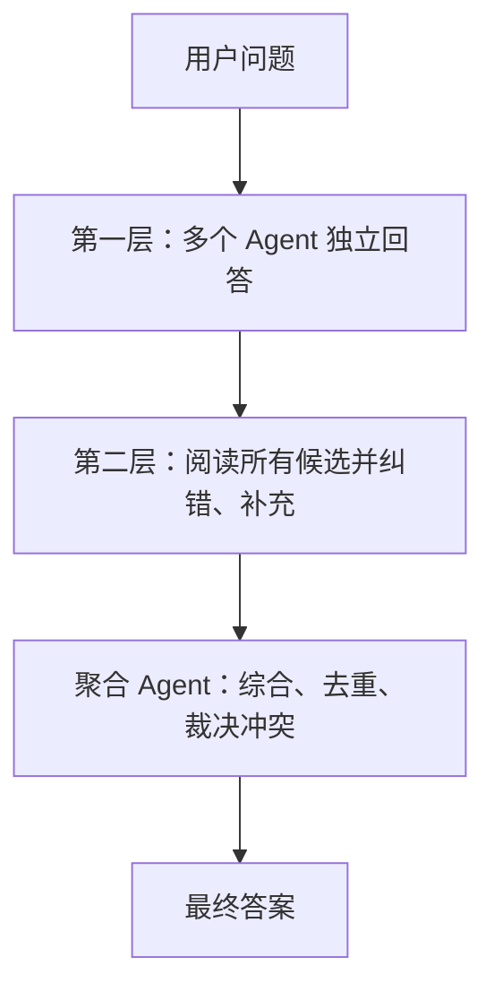

Mixture-of-Agents（MoA，智能体混合）的核心，是让多个大模型或智能体在推理阶段协作，通过“并行生成—相互参考—迭代改进—最终汇总”获得比单个模型更好的答案。

它可以理解为：用多个 AI 组成一个临时专家组。

## 一、主要原理

### 1. 多智能体并行生成

同一个任务首先交给多个 Agent 独立处理：

- Agent A 擅长逻辑推理
- Agent B 擅长代码
- Agent C 擅长事实核查
- Agent D 从用户体验或反方角度分析

这些 Agent 可以使用不同模型，也可以是同一个强模型通过不同提示词、角色或采样参数生成多个候选答案。

### 2. 分层协作与迭代精炼

经典 MoA 采用分层结构：

第 (l) 层的每个 Agent 不只看到原始问题，还会读取上一层所有 Agent 的输出：

[
y_i^{(l)} = A_i^{(l)}\left(x, y_1^{(l-1)}, \dots, y_n^{(l-1)}\right)
]

最后由一个聚合器生成最终结果。原始研究把这种现象称为 LLM 的“协作性”：模型即使自己没有直接得出最佳答案，也往往能够识别、整合和改进其他模型的答案。[ICLR 2025 原始论文](https://proceedings.iclr.cc/paper_files/paper/2025/file/5434be94e82c54327bb9dcaf7fca52b6-Paper-Conference.pdf)

### 3. 利用“质量＋多样性”

MoA 的效果主要来自两个因素：

- 质量：参与 Agent 本身必须足够强。
- 多样性：Agent 应提供不同解法、知识或检查视角。

但并非模型越多越好。后续研究发现，多次调用同一个强模型的 Self-MoA，在不少场景中反而优于混合多个强弱不一的模型。这说明“高质量候选”通常比单纯追求模型多样性更重要。[Self-MoA 研究](https://arxiv.org/abs/2502.00674)

### 4. 推理时扩展，而非必须重新训练

传统 MoA 通常工作在模型外部：

- 不必修改模型参数
- 不必重新训练底层模型
- 可以组合开源模型、闭源 API 和专业模型
- 可以随时更换 Agent、提示词和聚合策略

本质上属于一种“测试时计算扩展”：用更多推理次数换取更好的答案。

## 二、MoA 与 MoE 的区别

两者名字相近，但不是同一种技术。

| 维度         | Mixture-of-Agents（MoA）   | Mixture-of-Experts（MoE） |
| ------------ | -------------------------- | ------------------------- |
| 所在位置     | 模型外部的编排层           | 单个神经网络内部          |
| 基本单元     | 完整模型或智能体           | 模型内部的专家子网络      |
| 信息交换     | 自然语言、代码、工具结果   | 隐藏向量                  |
| 路由粒度     | 问题、任务或工作步骤       | 通常是 Token              |
| 是否需要训练 | 通常不需要                 | 通常需要联合训练          |
| 主要目标     | 提高推理质量和可靠性       | 扩大参数规模并控制计算量  |
| 主要代价     | API 成本、延迟、上下文长度 | 训练和部署复杂度          |

一句话概括：

> MoE 是“一个大脑内部有多个专家区域”，MoA 是“多个完整大脑组成专家委员会”。

## 三、主要应用方向

### 1. 复杂推理和科学问题

适用于数学、物理、逻辑分析、复杂规划等任务：

- 多个 Agent 使用不同方法解题
- 验证 Agent 检查公式和中间步骤
- 聚合器选择或组合正确推导
- 对冲单一路径产生的推理错误

### 2. 软件开发与自动测试

这也是非常适合 MoA 的方向：

- 架构 Agent：分析需求和设计方案
- 编码 Agent：实现功能
- 测试 Agent：运行真实使用流程
- 审查 Agent：查找缺陷、安全问题和技术债
- 修复 Agent：修改代码并执行回归测试
- 仲裁 Agent：判断是否达到交付标准

它特别适合你之前关注的“自我测试—发现问题—自动修复—回归验证—继续循环”开发模式。

### 3. 深度研究与知识综合

多个 Agent 可以分别负责：

- 搜索不同来源
- 阅读论文或文档
- 提取证据
- 交叉核验事实
- 分析相互冲突的结论
- 汇总为最终研究报告

这种架构比让一个 Agent 同时承担所有工作更容易保持覆盖面和可追溯性。

### 4. 企业决策支持

例如市场分析、产品决策、投资研究和风险评估：

- 乐观分析 Agent
- 悲观分析 Agent
- 数据核查 Agent
- 风险 Agent
- 决策聚合 Agent

它适合提供多角度辅助判断，但医疗、法律、金融等高风险场景仍应保留人工审核。

### 5. 高质量内容生成

适用于：

- 长篇报告
- 技术文档
- 营销方案
- 翻译与本地化
- 教学内容
- 剧本及创意策划

不同 Agent 分别负责初稿、事实核查、逻辑结构、风格统一和最终编辑。

### 6. 数据生成与模型训练

MoA 可以用来：

- 生成高质量合成训练数据
- 为同一问题产生多种解法
- 过滤错误或低质量样本
- 生成偏好比较数据
- 充当教师模型集成系统
- 对另一个模型的输出进行评估

### 7. 工具型和多模态 Agent

更广义的 MoA 可以混合不同能力：

- 搜索 Agent
- 浏览器 Agent
- 代码执行 Agent
- 数据分析 Agent
- 图像理解 Agent
- 数据库 Agent

例如某些 Agent 使用搜索，另一些使用代码计算，再由综合 Agent 汇总证据。TUMIX 等研究正在探索这种“工具使用策略混合”。[TUMIX 论文](https://arxiv.org/abs/2510.01279)

## 四、当前主要问题

MoA 并不会自动保证结果更正确，主要局限包括：

- 成本成倍增加：多个 Agent 都要进行完整推理。
- 延迟较高：层与层之间必须顺序等待。
- 上下文膨胀：后层需要读取大量候选输出。
- 错误传播：多个 Agent 可能复制同一个错误。
- 弱模型污染：低质量候选可能误导聚合器。
- 聚合器瓶颈：最终 Agent 可能无法正确识别最佳答案。
- “假讨论”问题：Agent 表面上互相批评，实际上没有增加有效信息。
- 难以确定停止条件：继续增加轮次不一定继续提高质量。

因此目前的重要演进方向是：

- 动态选择最适合当前任务的 Agent
- 只激活少量高价值 Agent
- 根据难度自动决定协作轮数
- 使用测试、执行结果或外部证据裁决
- 引入置信度和早停机制
- 对 Agent 质量、成本和延迟进行联合路由

例如 RouteMoA 使用动态路由预先筛选模型，以降低密集 MoA 的成本和延迟。[RouteMoA 论文](https://arxiv.org/abs/2601.18130)

总体来说，MoA 最适合“错误代价较高、任务复杂、可以接受更高推理成本”的工作；对于简单问答和低延迟业务，单个强模型通常更加划算。 
