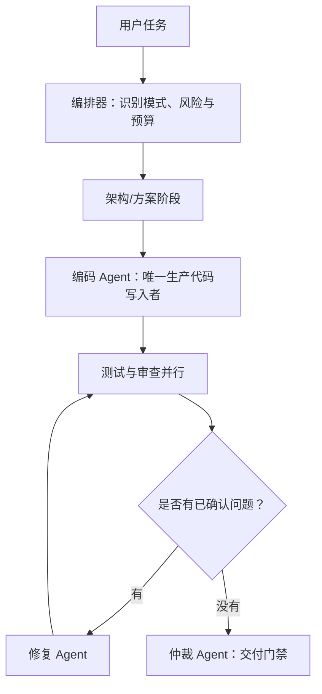
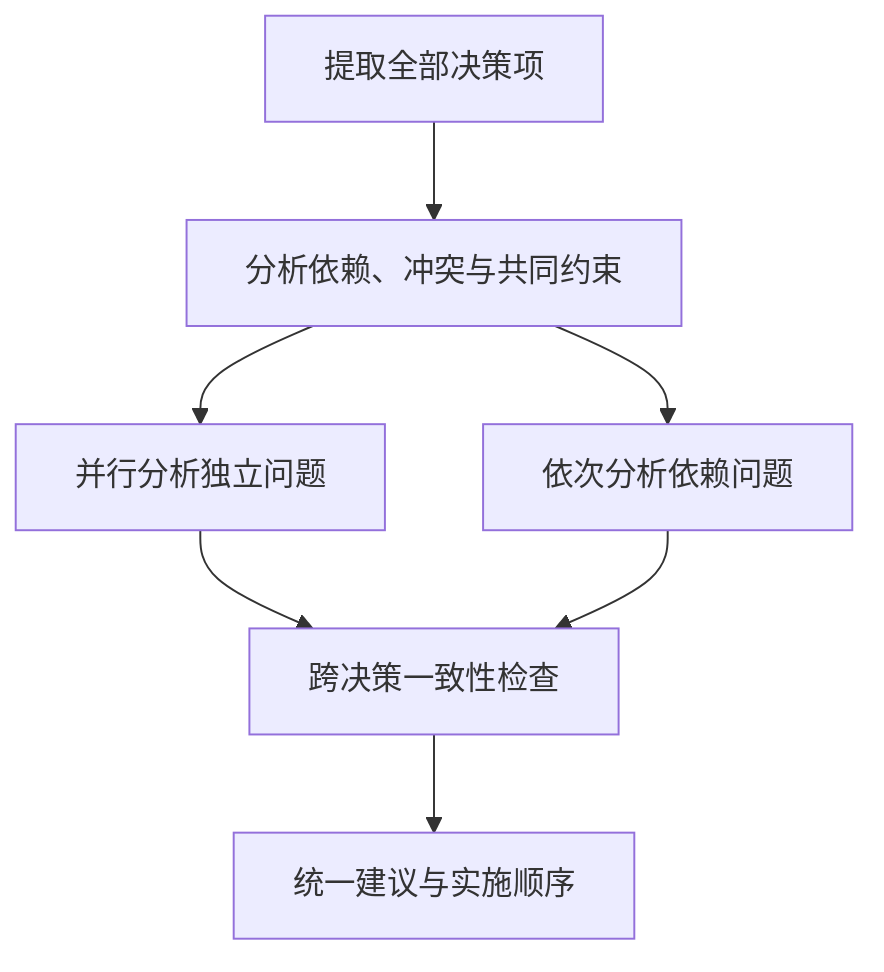

非常适合。但最核心的建议是：

> 不要设计成“六个 Agent 每次固定串行执行”，而应做成“一个编排器＋按需激活的专家 Agent＋单写入者＋证据驱动仲裁＋预算与停止机制”。

这能显著缓解 MoA 的成本、延迟、上下文膨胀、弱模型污染和无限循环问题。

## 一、建议的产品定位

推荐名称：

- Plugin：`software-delivery-council`
- 核心 Skill：`orchestrate-delivery-review`
- 中文名：软件交付评审委员会

它不只是“自动开发 Skill”，而是一个可切换模式的决策与质量控制系统：

| 模式           | 用途               | 默认参与者                     |
| -------------- | ------------------ | ------------------------------ |
| `brainstorm`   | 头脑风暴、方案发散 | 3 个提案者＋批判者＋仲裁者     |
| `recommend`    | 比较方案、给出建议 | 架构师＋领域专家＋反方＋仲裁者 |
| `review`       | 评审现有设计或代码 | 架构、测试、审查 Agent         |
| `deliver`      | 从需求到实现与修复 | 完整六阶段                     |
| `release-gate` | 判断能否交付       | 测试、审查、仲裁 Agent         |
| `auto`         | 根据风险自动选择   | 动态路由                       |

不要让简单问题也启动全部六个 Agent，否则很快会变成“质量提高一点，成本增加六倍”。

## 二、增加一个“编排 Agent”

在你列出的六个 Agent 之外，建议增加一个不参与发表技术意见的编排器：



编排器只负责：

- 明确需求、非目标和验收标准
- 判断需要哪些 Agent
- 控制并行度、轮数和成本
- 管理问题清单与状态
- 防止多个 Agent 同时修改同一文件
- 收集证据后交给仲裁者

Codex 当前支持由 Skill 指令触发专门的子 Agent，官方也建议优先并行处理代码探索、测试、日志分析等“读密集型”工作，对并行写代码保持谨慎。[Codex Subagents 文档](https://developers.openai.com/codex/concepts/subagents)

## 三、严格定义每个 Agent 的权限

| Agent      | 权限                       | 必须产出                          | 禁止事项             |
| ---------- | -------------------------- | --------------------------------- | -------------------- |
| 架构 Agent | 只读                       | 需求理解、候选方案、权衡、风险    | 直接修改代码         |
| 编码 Agent | 生产代码写入               | 实现、变更说明、自测结果          | 自己批准自己的实现   |
| 测试 Agent | 执行测试；必要时独占写测试 | 真实流程、复现步骤、预期/实际结果 | 修改生产代码掩盖失败 |
| 审查 Agent | 只读                       | 正确性、安全、性能、技术债发现    | 只报告风格偏好       |
| 修复 Agent | 独占写入                   | 根因、最小修复、回归验证          | 顺便重构无关代码     |
| 仲裁 Agent | 只读                       | `PASS/BLOCKED/INCONCLUSIVE` 决定  | 修改后再自行批准     |
| 编排 Agent | 控制流程                   | 路由、状态、预算、上下文包        | 代替专家给结论       |

最重要的规则是：

> 同一时间只能有一个 Agent 修改生产代码。

测试、探索和审查可以并行；编码和修复必须取得“写入锁”后串行执行。

## 四、仲裁不能依靠“多数投票”

多个 Agent 同意并不代表正确。仲裁应采用“证据优先”：

每条发现必须包含：

```yaml
id:
category:
severity: critical | high | medium | low | nit
confidence: high | medium | low
evidence:
reproduction:
expected_behavior:
actual_behavior:
impact:
suggested_fix:
status: new | confirmed | rejected | fixed | verified | waived
```

仲裁优先级建议为：

1. 可重复执行的测试结果
2. 编译器、类型检查器、静态分析器结果
3. 运行日志和代码路径证据
4. 官方文档或规范
5. Agent 的逻辑判断
6. Agent 数量或投票结果

客观门槛尽量交给确定性脚本判断，Agent 只负责主观权衡。例如：

- 测试退出码是否为 0
- 是否存在未解决的 `critical/high`
- 最终修复后是否完成回归
- 是否达到最大轮数
- 是否连续两轮只剩低等级问题

## 五、采用“先独立、后讨论”机制

为了避免所有 Agent 相互模仿：

1. 第一轮独立分析，不允许看到其他 Agent 的结论。
2. 编排器对结果去重，但保留不同意见。
3. 第二轮让批判或审查 Agent 查看候选结果。
4. 最后由仲裁者读取原始证据和少数意见。
5. 不要只把一份过度压缩的摘要交给仲裁者。

对于头脑风暴，先发散再收敛：

- 提案者分别提出不同方向
- 批判者寻找假设、成本和失败条件
- 仲裁者按照预先确定的标准排序
- 保留一个“少数意见”，避免有价值的非主流方案被平均掉

## 六、设置清晰的停止条件

建议使用四种最终状态：

- `PASS`：达到全部交付标准
- `PASS_WITH_RISK`：仅有明确接受的低风险问题
- `BLOCKED`：存在阻断性缺陷或缺少必要条件
- `INCONCLUSIVE`：预算或环境不足，不能证明通过

默认停止条件可以是：

- 所有验收标准已经验证
- 不存在未解决的 `critical/high`
- `medium` 问题已修复或经用户明确豁免
- 最终回归测试通过
- 连续两轮没有新增 `medium` 以上问题
- 连续两轮只剩 `low/nit`
- 达到最大轮数或预算时停止，并标记为 `INCONCLUSIVE`，绝不能假装通过

建议默认配置：

```yaml
mode: auto
max_agents: 4
max_parallel_readers: 3
max_writers: 1
max_repair_rounds: 5
convergence_window: 2
stop_below_severity: low
require_final_regression: true
```

## 七、Skill 与 Plugin 的组织方式

建议先把核心工作流做成一个 Skill，稳定后再封装成 Plugin。官方定位也是：Skill 负责可复用流程，Plugin 负责安装、分发，以及打包 Skills、MCP、Hooks、连接器等能力。[Codex 自定义文档](https://developers.openai.com/codex/concepts/customization)、[Plugin 构建文档](https://developers.openai.com/codex/plugins/build)

推荐结构：

```text
software-delivery-council/
├── .codex-plugin/
│   └── plugin.json
└── skills/
    └── orchestrate-delivery-review/
        ├── SKILL.md
        ├── agents/
        │   └── openai.yaml
        ├── references/
        │   ├── modes.md
        │   ├── role-contracts.md
        │   ├── quality-gates.md
        │   └── output-schemas.md
        └── scripts/
            ├── validate-findings.py
            ├── evaluate-gate.py
            └── merge-agent-results.py
```

不要一开始创建六个互相独立的 Skill。那样容易出现：

- 触发条件冲突
- 无法保证执行顺序
- 每个 Skill 各自维护状态
- 仲裁者拿不到统一证据
- 修改权限难以控制

更好的方式是：

- 一个核心编排 Skill
- 六份角色契约
- 三个确定性校验脚本
- 必要时动态生成对应子 Agent

## 八、降低成本和上下文污染

建议加入三级路由：

- 低风险：主 Agent 完成＋一次测试
- 中风险：2～3 个只读 Agent 并行评审
- 高风险：完整六阶段与交付门禁

同时：

- 只把相关文件和任务摘要交给子 Agent
- 不在每轮重复传递完整历史
- 后续轮次只处理新增或仍未关闭的问题
- 修复后只运行受影响测试，再运行最终全量回归
- 弱模型用于搜索、分类、日志整理
- 强模型用于架构、复杂审查和最终仲裁
- 不固定具体模型名称，使用“快速/标准/高可靠”能力等级配置

## 九、建议的第一版范围

我建议 `v0.1` 先实现：

1. `auto/brainstorm/recommend/review/deliver/release-gate` 六种模式
2. 动态选择 1～6 个 Agent
3. 单写入者规则
4. 统一问题数据结构
5. 四种仲裁结果
6. 连续两轮低等级问题的停止机制
7. 最大轮次和预算保护
8. 三组真实项目验证：小修复、功能开发、发布前评审

暂时不要加入：

- 自动 GitHub/CI 操作
- 自动提交或发布
- 深层递归子 Agent
- 多个 Agent 同时改代码
- 未经确认自动修复低置信度问题

这套设计既适合完整开发闭环，也能单独用于评审、决策、推荐和头脑风暴。按 Skill 的渐进加载原则，把核心编排保持简短，把角色契约、质量门槛和输出格式拆入 `references/`，确定性检查放入 `scripts/`，会比一份超长提示词更稳定、更容易迭代。 

---

还有个需求就是我在遇到编程过程中遇到需要做决策或给方案的问题，或几条需要做决策的问题可以直接丢给它，或让它根据上下文情况，让它给出科学准确的建议。


这个需求很关键。基于它，我建议把上一版结构调整为：

> 一个 Plugin，两个相互配合但权限不同的 Skill。

这样既能完成开发闭环，又能随时作为独立的“技术决策委员会”使用。

## 推荐结构

Plugin 名称：

```
software-engineering-council
```

包含两个 Skill：

| Skill                           | 作用                                     | 默认权限         |
| ------------------------------- | ---------------------------------------- | ---------------- |
| `decide-engineering-options`    | 方案比较、技术选型、建议、决策、头脑风暴 | 严格只读         |
| `orchestrate-software-delivery` | 架构、编码、测试、审查、修复、交付仲裁   | 可按阶段修改代码 |

Plugin 本身可以包含多个 Skill，这正适合把“决策咨询”和“代码实施”分开，避免你只是咨询方案时，Agent 擅自开始改代码。[Codex Plugin 文档](https://developers.openai.com/codex/plugins/build)

## 一、决策 Skill 的使用体验

你可以直接输入：

```text
@decide-engineering-options

这个项目的数据层应该选择 PostgreSQL 还是 MongoDB？
缓存应该使用 Redis 还是进程内缓存？
API 应该使用 REST 还是 GraphQL？
```

也可以直接丢一段非结构化描述：

```text
@decide-engineering-options

现在系统有性能问题，我在考虑拆微服务、增加缓存或者先优化数据库。
另外不知道要不要换消息队列，帮我一起判断。
```

Skill 自动完成：

1. 提取所有待决策问题
2. 识别问题之间的依赖关系
3. 补全隐含约束和评价标准
4. 判断哪些问题可以并行分析
5. 搜集项目证据和官方资料
6. 比较候选方案
7. 必要时运行小型实验或基准测试
8. 给出推荐、置信度、风险和验证方法

只有缺失信息确实可能改变结论时，才向你提出少量关键问题；否则应明确假设并直接给出条件化建议。

## 二、不要承诺“绝对准确”，而要做到科学可验证

Skill 的目标最好定义为：

> 基于证据、可复现、包含不确定性、能够解释和验证的工程决策。

不能依靠“多个 Agent 都同意”，而应采用以下证据等级：

1. 当前项目的代码、配置和实际运行结果
2. 可重复的测试、性能基准和最小实验
3. 当前版本的官方文档、标准及规范
4. 项目明确的需求和约束
5. 经过验证的工程原则
6. Agent 的经验判断
7. 多数投票

如果没有足够证据，必须输出“证据不足”，不能为了看起来确定而强行推荐。

## 三、决策模式的 Agent 组合

不用启动完整开发团队。建议动态选择：

| Agent            | 任务                                 |
| ---------------- | ------------------------------------ |
| 上下文分析 Agent | 阅读项目，确认现状、约束和真正问题   |
| 方案 Agent       | 独立提出候选方案，包括“保持现状”     |
| 证据 Agent       | 核对官方文档、代码、测试和版本兼容性 |
| 反方 Agent       | 寻找失败条件、隐藏成本和反例         |
| 实验 Agent       | 必要时编写最小原型或运行基准测试     |
| 仲裁 Agent       | 根据证据和标准给出最终建议           |

默认配置可以是：

- 简单可逆决策：上下文分析＋仲裁
- 普通技术选型：方案＋证据＋反方＋仲裁
- 高风险架构决策：完整组合＋最小实验
- 安全、数据迁移、不可逆决策：必须保留人工确认

## 四、多项决策不能简单逐条独立回答

几条决策可能互相影响，例如：

- 是否拆微服务
- 是否引入消息队列
- 如何处理分布式事务
- 选择哪种数据库

正确流程应该先生成决策依赖关系：



最终不仅要告诉你每一项选择什么，还要回答：

- 这些建议组合起来是否一致
- 哪个决定必须先做
- 哪些选择会限制后续选择
- 是否存在整体更优的方案组合
- 一个前提改变后，哪些结论需要重新评估

## 五、科学决策流程

### 1. 先确定评价标准

在看到方案结论前，先确定标准，避免为了偏好的方案倒推理由。

常见标准包括：

- 正确性
- 安全性
- 可维护性
- 性能
- 可靠性
- 开发成本
- 运行成本
- 团队学习成本
- 迁移风险
- 可逆性
- 生态成熟度
- 与现有系统兼容性

### 2. 给标准设置权重

例如：

```yaml
criteria:
  correctness: 25
  maintainability: 20
  reliability: 20
  implementation_cost: 15
  performance: 10
  reversibility: 10
```

评分可以辅助判断，但不能制造虚假的数学精确性。

建议同时做“敏感性分析”：

- 权重改变后，推荐是否仍然成立？
- 如果性能重要性提高，结果是否翻转？
- 如果项目周期缩短一半，结果是否改变？

如果稍微调整权重结论就发生变化，应将置信度标为低或中，而不是给出强结论。

### 3. 优先验证关键假设

例如，争论“Redis 是否能解决性能问题”之前，先验证瓶颈是不是缓存命中问题。

决策 Skill 应能够建议或执行：

- 最小可行原型
- 小范围性能基准
- 数据库查询分析
- 依赖兼容性检查
- 迁移演练
- 故障注入
- 真实用户流程测试

原则是：

> 能用低成本实验消除的不确定性，不用 Agent 辩论解决。

## 六、统一输出格式

面对多项问题，首先输出决策摘要：

| ID   | 问题       | 推荐           | 置信度 | 核心依据                  | 下一步           |
| ---- | ---------- | -------------- | ------ | ------------------------- | ---------------- |
| D1   | 数据库选择 | PostgreSQL     | 高     | 强事务需求、现有 SQL 生态 | 建立数据模型原型 |
| D2   | 缓存方案   | 暂不引入 Redis | 中     | 尚未证明瓶颈来自重复读取  | 先完成性能剖析   |
| D3   | API 形式   | REST           | 中高   | 需求稳定、客户端数量有限  | 建立接口契约     |

随后逐项提供：

```text
决策问题
当前背景
关键假设
候选方案
评价标准
证据与实验结果
推荐方案
不推荐其他方案的原因
主要风险
缓解措施
置信度
结论失效条件
验证步骤
回退方案
```

其中“结论失效条件”非常重要，例如：

> 当前建议 REST；如果未来出现多个客户端需要高度不同的数据组合，应重新评估 GraphQL。

这让建议不会被误当成永久真理。

## 七、区分建议和执行

决策 Skill 默认必须只读：

- 不修改项目
- 不安装依赖
- 不创建架构
- 不自动执行推荐方案
- 可以运行无副作用的检查
- 需要实验性代码时先说明范围

完成决策后再询问或等待你明确要求：

```text
采纳 D1 和 D3，进入实施阶段。
```

然后才把已采纳结论交给 `orchestrate-software-delivery` 执行。

这样形成清晰闭环：

```text
发现问题
→ 决策委员会分析
→ 用户采纳或调整
→ 开发 Skill 实施
→ 测试和审查
→ 交付仲裁
```

## 八、建议增加决策记录

当你采纳某项重要决定后，可以选择生成 ADR（Architecture Decision Record）：

```text
docs/decisions/
├── ADR-001-database-selection.md
├── ADR-002-cache-strategy.md
└── ADR-003-api-style.md
```

记录：

- 当时为什么做这个决定
- 比较过哪些方案
- 基于哪些约束
- 哪些条件变化后需要重新评估

但咨询阶段只生成建议，不应自动写入项目；由你采纳后再保存。

最终，这个 Plugin 应有两个明确入口：

```text
@decide-engineering-options
把问题交给技术决策委员会，只分析，不改代码。

@orchestrate-software-delivery
执行已经确定的方案，完成开发、测试、修复和交付仲裁。
```

这种“双 Skill、同一 Plugin”的设计，比把所有功能塞进一个超大 Skill 更安全，触发更准确，也更适合你在日常编程过程中随时丢入一项或多项决策问题。
